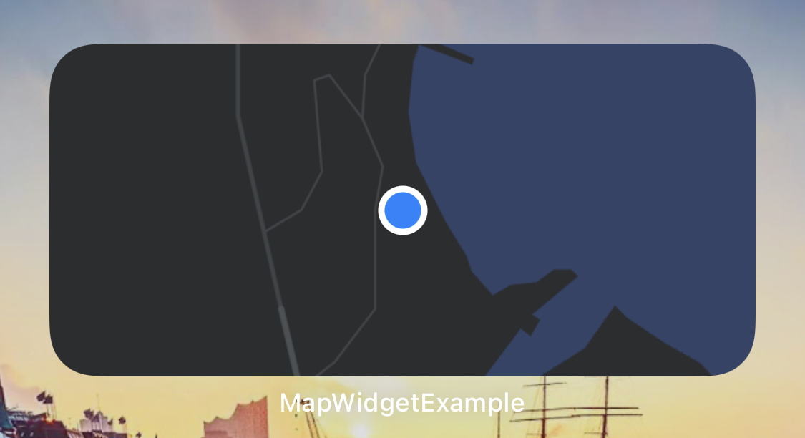

# MapWidgetExample
🗺 – Example application showing how to display a map with the current user-location inside a widget.



**Note:** As a `UIViewRepresentable` is not supported in widgets, Apple's recommendation for displaying maps inside widgets is to use a [`MKMapSnapshotter`](https://developer.apple.com/documentation/mapkit/mkmapsnapshotter).

## Privacy related code
🔐 – To receive the current user-location you have to add the following lines to the `Info.plist` of your application.

```
Privacy - Location When In Use Usage Description
Privacy - Location Usage Description
```

Furthermore you have to add these three lines to the `Info.plist` of your widget extension as well.

```
Privacy - Location When In Use Usage Description
Privacy - Location Usage Description
Widget Wants Location
```

## Links
- [Creating a Widget Extension](https://developer.apple.com/documentation/widgetkit/creating-a-widget-extension)